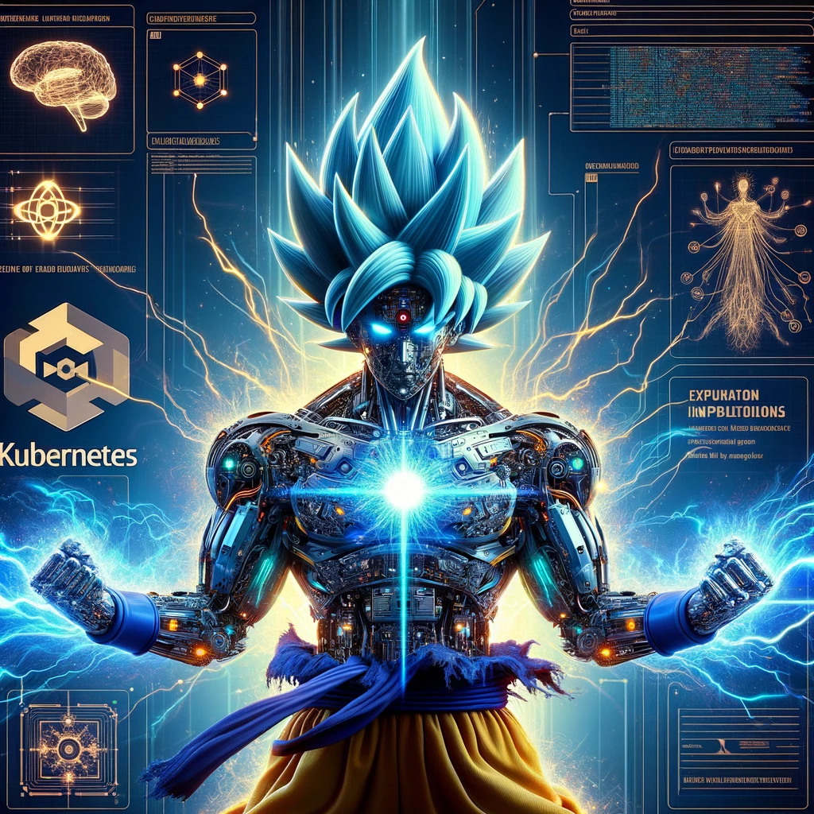

# GOKU: <u>G</u>enAI<u>O</u>ps on <u>Ku</u>bernetes
## A reference architecture for performing Generative AI Operations (aka GenAIOp) using Kubernetes-native open source tools

## Installation
For installation, follow the steps provided in [the setup doc](docs/installation_guide.md)