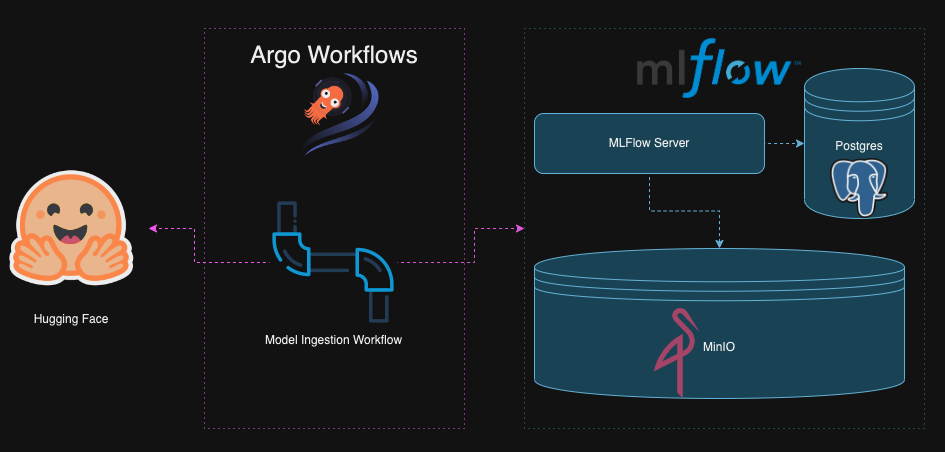
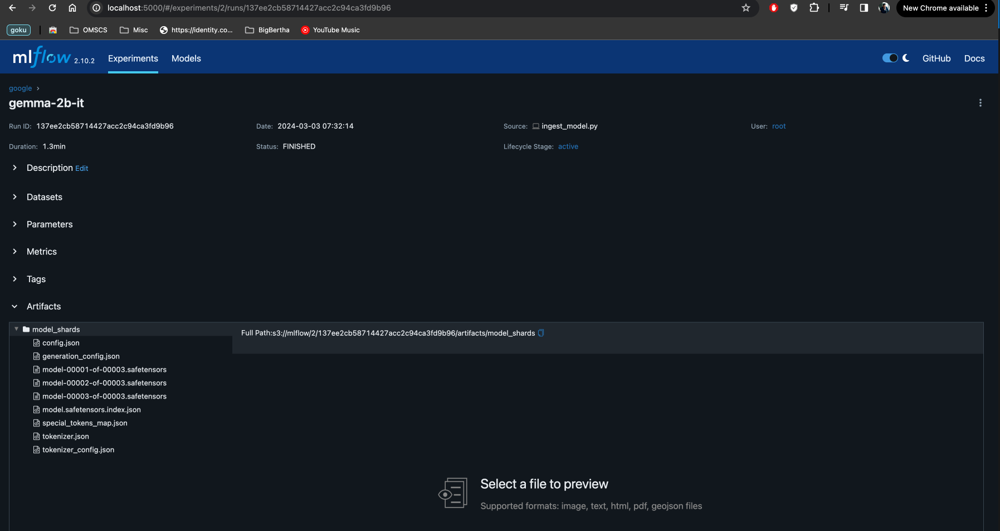
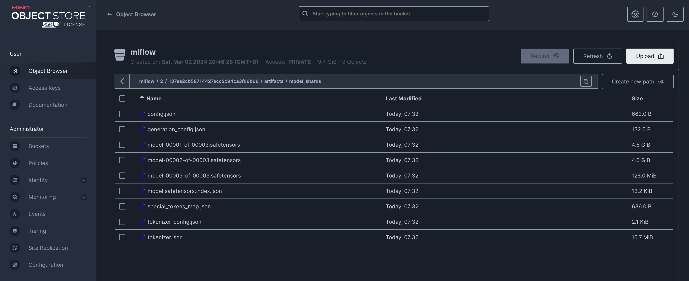
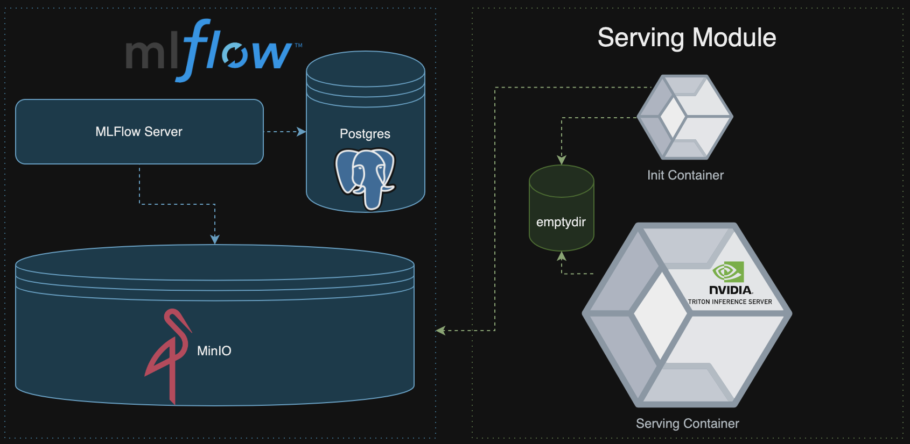
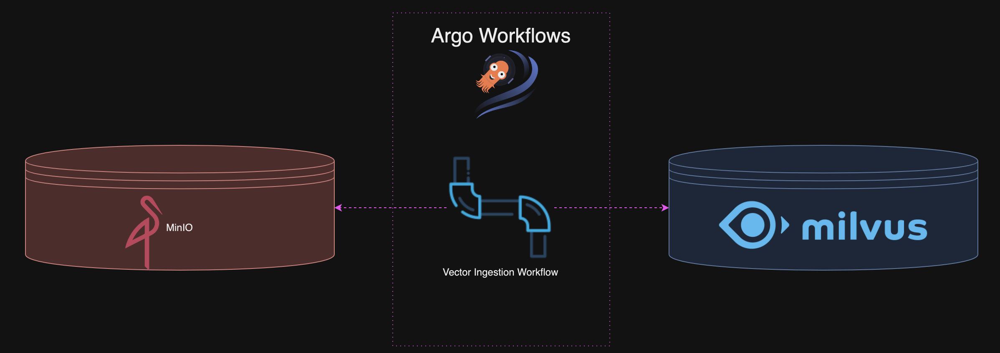
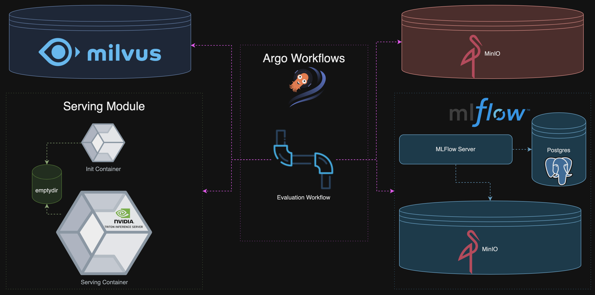
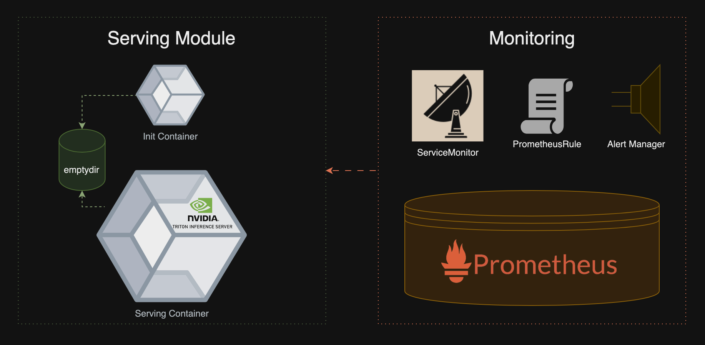

# GOKU: <u>G</u>enAI<u>O</u>ps on <u>Ku</u>bernetes
A reference architecture for performing Generative AI Operations (aka GenAIOps) using Kubernetes, with open source tools

## Table of Contents
- [Installation](#installation)
- [Features](#features)
  - [Model Ingestion](#model-ingestion)
  - [Model Serving](#model-serving)
  - [Vector Ingestion](#vector-ingestion)
  - [End-to-end RAG Evaluation](#end-to-end-rag-evaluation)
  - [Model Monitoring](#model-monitoring)
  
## Installation
For installation, follow the steps provided in [the setup doc](docs/installation_guide.md)

## Features
### Model Ingestion

GOKU uses a customisable Argo Workflows template to download models from Hugging Face and ingest them into MLFlow.

How to run

To run the model ingestion with the default image, follow these steps:

1. Navigate to the Argo Workflows UI (see steps in [the setup doc](docs/installation_guide.md) if unsure)
2. Enter the "goku" namespace and click on "SUBMIT NEW WORKFLOW"
3. Select "model-ingestion" as the template to be used
4. Enter the name of the model you want to ingest and click on "SUBMIT"

5. You should see the model ingestion workflow running

6. Once the workflow completes successfully, you should be able to see the model files saved as artifacts on mlflow

7. You should also be able to verify that the model artifacts have been ingested successfully using MinIO console 

### Model Serving
(WIP)

### Vector Ingestion
(WIP)

### DREAM: Distributed RAG Experimentation & Evaluation Framework
(WIP)

### End-to-end RAG Evaluation
(WIP)

### Model Monitoring
(WIP)
