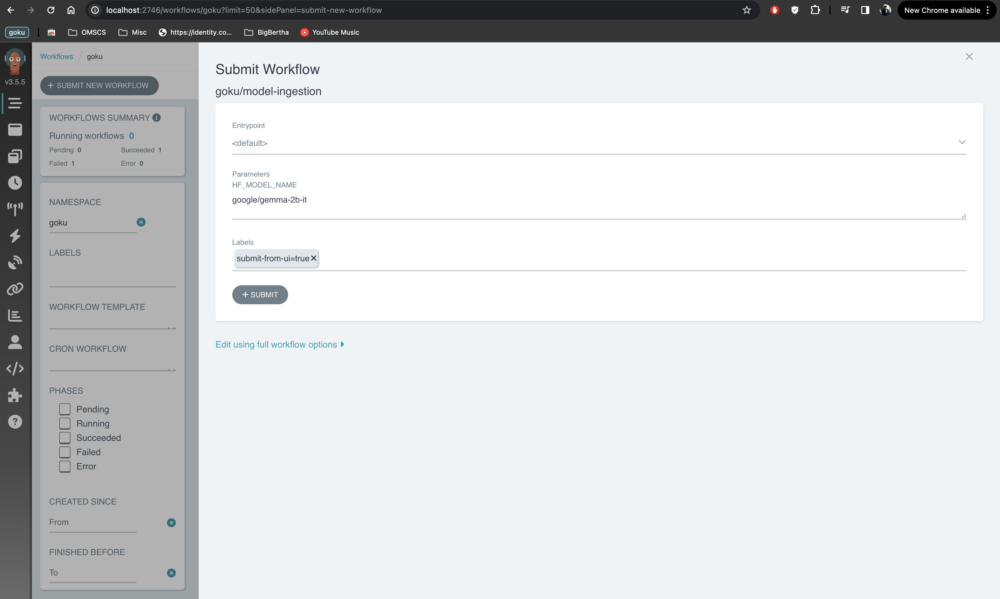
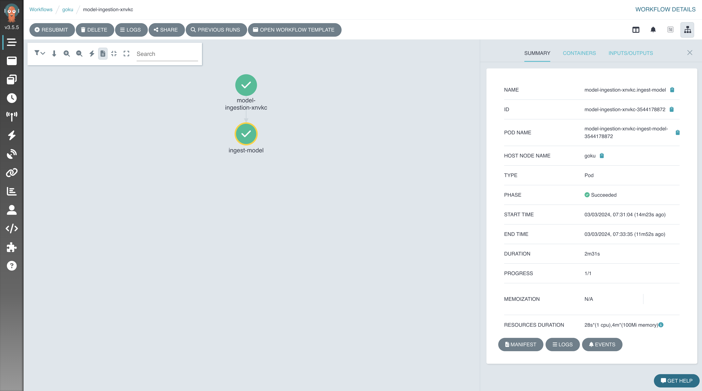

# GOKU: <u>G</u>enAI<u>O</u>ps on <u>Ku</u>bernetes
A reference architecture for performing Generative AI Operations (aka GenAIOps) using Kubernetes, with open source tools

## Installation
For installation, follow the steps provided in [the setup doc](docs/installation_guide.md)

## Features
### Opensource Model Ingestion
GOKU provides a customisable workflow to download models from Hugging Face and ingest them into MLFlow. To run the model ingestion with the default image, follow the following steps:
1. Navigate to the Argo Workflows UI (see steps in [the setup doc](docs/installation_guide.md) if unsure)
2. Enter the "goku" namespace and click on "SUBMIT NEW WORKFLOW"
3. Select "model-ingestion" as the template to be used
4. Enter the name of the model you want to ingest and click on "SUBMIT"

5. You should see the model ingestion workflow running

6. Once the workflow completes successfully, you should be able to see the model files saved as artifacts on mlflow

