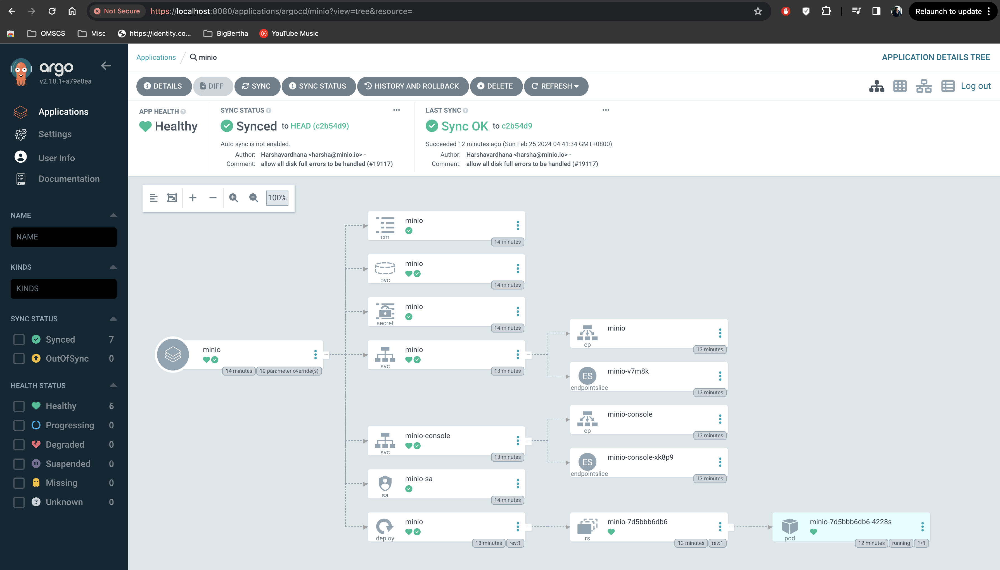
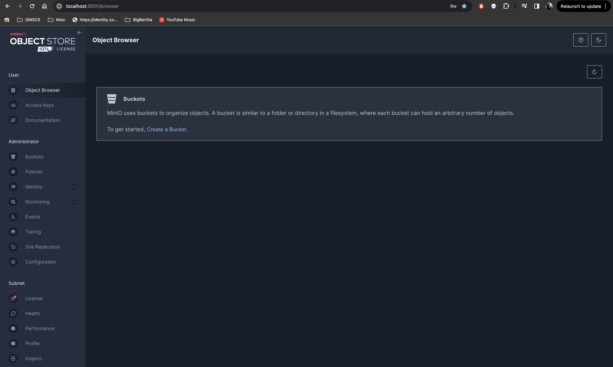

# Installation Guide

## Prerequisites
ToDo

## Cluster Setup
1. Setup the Kubernetes cluster using [kubeadm](setup_k8s.md)
2. Setup argocd by running the [argocd installation script](../scripts/setup_argocd.sh). `bash scripts/setup_argocd.sh` should get the job done.
3. To view ArgoCD UI, run the following to obtain admin secret and setup port-forwarding
```shell
kubectl -n argocd get secret argocd-initial-admin-secret -o jsonpath="{.data.password}" | base64 -d && echo
kubectl -n argocd port-forward svc/argocd-server 8080:80 &
```

## MinIO Setup
1. To setup the prerequisites, run the [minio prerequisites script](../scripts/minio_prereq.sh). `bash scripts/minio_prereq.sh` should get the job done.
2. Run the command `kubectl apply -f apps/minio.yaml` which will install MinIO as an argocd app
3. Navigate to ArgoCD UI, select the MinIO app and click on "Sync">"Synchronize"
4. Observe to ensure that everything gets setup correctly, including the logs of the minio pod

5. To navigate to MinIO console, setup port-forwarding using `kubectl -n minio port-forward svc/minio-console 9001`
6. Login using the username "admin" and password "password" (as is set in [config](../apps/minio.yaml))
7. You should eventually end up on the MinIO console


## Postgres Setup
1. To setup the prerequisites, run the [postgres prerequisites script](../scripts/postgres_prereq.sh). `bash scripts/postgres_prereq.sh` should get the job done.
2. Run the command `kubectl apply -f apps/postgres.yaml`
3. Navigate to ArgoCD UI, select the Postgres app and click on "Sync">"Synchronize"
4. Observe to ensure that everything gets setup correctly, including the logs of the minio pod

5. For further interactions with postgres (eg: creating mlflow schema), we need the psql client. Install it using `sudo apt-get install postgresql-client`.
6. You can run `psql --version` to verify installation

## MLFlow Setup