# Installation Guide

## 1. Cluster Setup
1. Setup the Kubernetes cluster using [kubeadm](setup_k8s.md)
2. Setup argocd by running the [argocd installation script](../k8s/scripts/setup_argocd.sh). `bash k8s/scripts/setup_argocd.sh` should get the job done.
3. To view ArgoCD UI, run the following to obtain admin secret and setup port-forwarding
```shell
kubectl -n argocd get secret argocd-initial-admin-secret -o jsonpath="{.data.password}" | base64 -d && echo
kubectl -n argocd port-forward svc/argocd-server 8080:80 &
```

## 2. MinIO Setup
1. To setup the prerequisites, run the [minio prerequisites script](../k8s/scripts/minio_prereq.sh). `bash k8s/scripts/minio_prereq.sh` should get the job done.
2. Run the command `kubectl apply -f k8s/argocd_apps/minio.yaml` which will install MinIO as an argocd app
3. Navigate to ArgoCD UI, select the MinIO app and click on "Sync">"Synchronize"
4. Observe to ensure that everything gets setup correctly, including the logs of the minio pod

5. To navigate to MinIO console, setup port-forwarding using `kubectl -n minio port-forward svc/minio-console 9001`
6. Login using the username "admin" and password "password" (as is set in [config](../k8s/argocd_apps/minio.yaml))
7. You should eventually end up on the MinIO console


## 3. Postgres Setup
1. To setup the prerequisites, run the [postgres prerequisites script](../k8s/scripts/postgres_prereq.sh). `bash k8s/scripts/postgres_prereq.sh` should get the job done.
2. Run the command `kubectl apply -f k8s/argocd_apps/postgres.yaml`
3. Navigate to ArgoCD UI, select the Postgres app and click on "Sync">"Synchronize"
4. Observe to ensure that everything gets setup correctly, including the logs of the postgres pod

5. For further interactions with postgres (eg: creating mlflow database), we need the psql client. Install it using `sudo apt-get install postgresql-client`.
6. You can run `psql --version` to verify installation

## 4. MLFlow Setup
1. Ensure that MinIO and Postgres are setup as specified in steps 2 and 3 above
2. Navigate to the MinIO console and create a new bucket called "mlflow" 
3. Create a new policy
```json
{
    "Version": "2012-10-17",
    "Statement": [
        {
            "Effect": "Allow",
            "Action": [
                "s3:GetBucketLocation",
                "s3:ListBucket"
            ],
            "Resource": [
                "arn:aws:s3:::mlflow"
            ]
        },
        {
            "Effect": "Allow",
            "Action": [
                "s3:DeleteObject",
                "s3:GetObject",
                "s3:PutObject"
            ],
            "Resource": [
                "arn:aws:s3:::mlflow/*"
            ]
        }
    ]
}
```
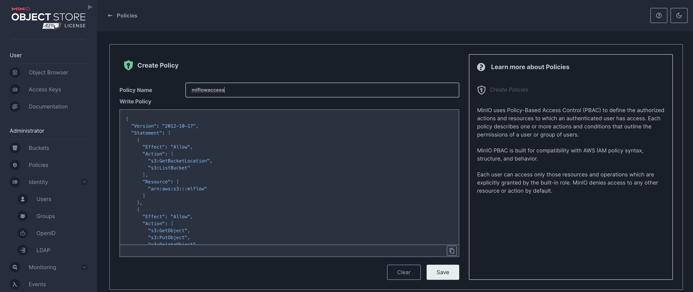
4. On MinIO create a new user and select the policy you just created to associate it with the new user you are creating
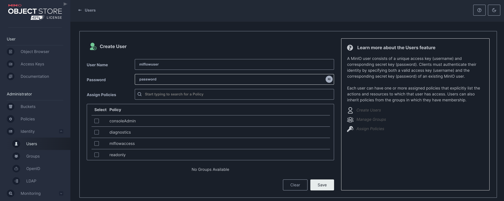
5. Next, create a new access key for this user
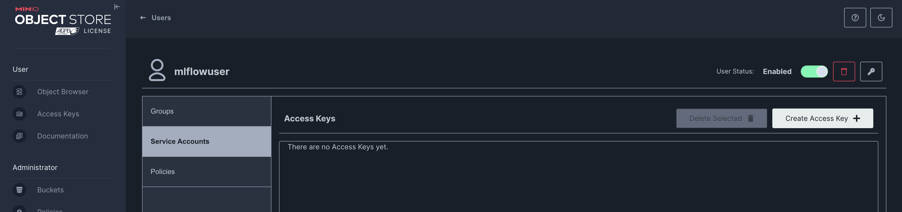

Record/download this access key as we will need to authenticate MLflow server against the S3 bucket later on.
6. Run the following commands to setup the "mlflow" database in Postgres
```shell
# install psql
sudo apt update
sudo apt install postgresql postgresql-contrib

kubectl -n postgresql port-forward svc/postgres-postgresql 5432 &
psql -h localhost -p 5432 -U postgres
#Enter password "password" when prompted
CREATE DATABASE mlflow;
\q
```
7. Run the command `kubectl apply -f k8s/argocd_apps/mlflow.yaml`
8. Navigate to ArgoCD UI, navigate to the MLFlow app and click on "Details" then "Edit" then "Parameters" tab to replace the placeholder values of the artifactRoot.s3.awsAccessKeyId and artifactRoot.s3.awsSecretAccessKey with the accesskey credentials you created in the MinIO steps above

9. Next, click on "Sync"
10. Observe to ensure that everything gets setup correctly, including the logs of the mlflow pod
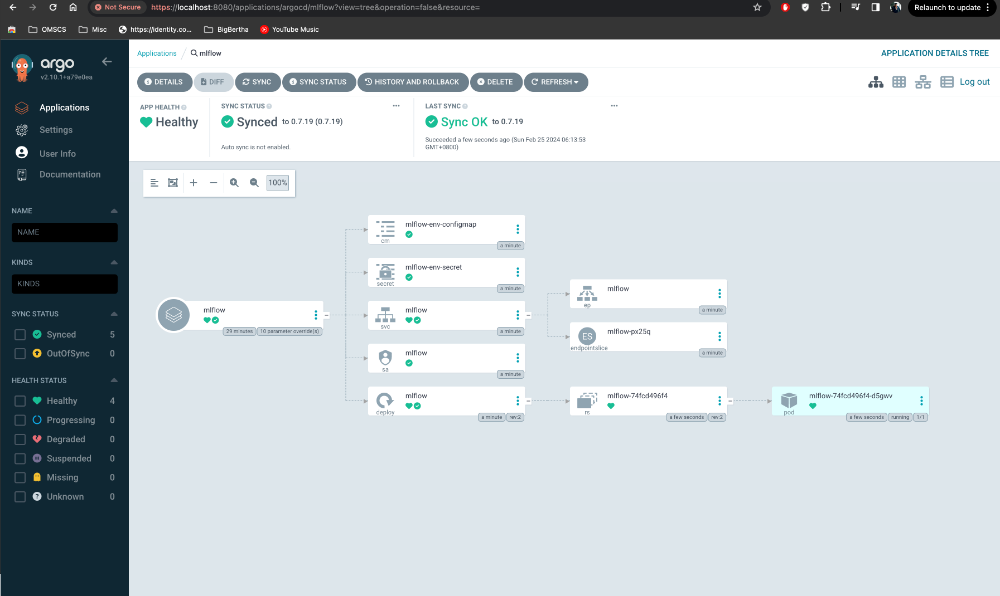
11. You can use `kubectl -n mlflow port-forward svc/mlflow 5000` to port-forward to the MLFlow server and UI
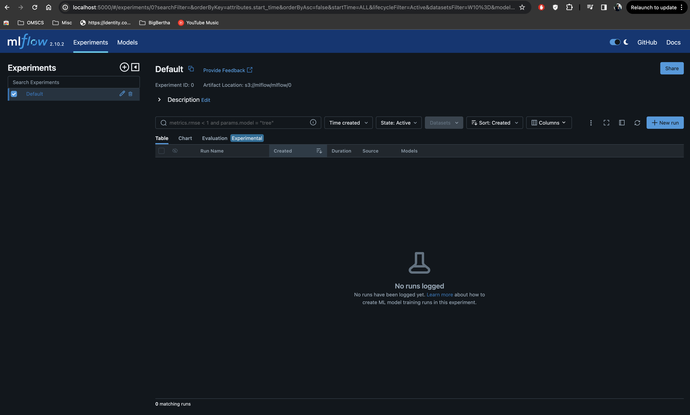

## 5. ArgoWorkflows Setup
1. To setup ArgoWF, simply run `kubectl apply -f k8s/argocd_apps/argowf.yaml`
2. Navigate to ArgoCD UI and click on "Sync">"Syncrhonize"
3. Observe to ensure that everything gets setup correctly
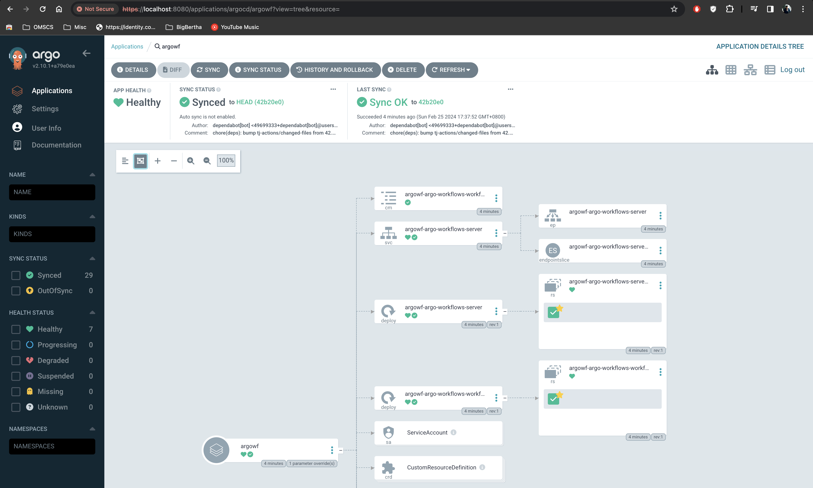
4. Run the following command to obtain admin token required for login in the coming steps
`kubectl -n argowf exec -it $(kubectl get pods -n argowf | grep argo-workflows-server | awk '{print $1}') -- argo auth token`
5. To view the ArgoWF UI, port-forward using `kubectl -n argowf port-forward svc/argowf-argo-workflows-server 2746`
6. To login, stick the Bearer token obtained in and click "Login"
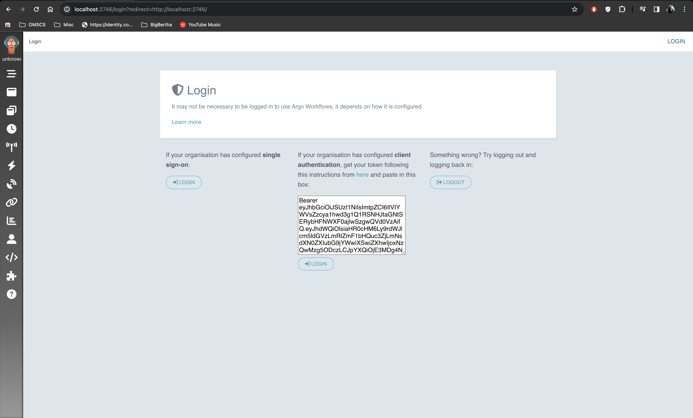
Voila!
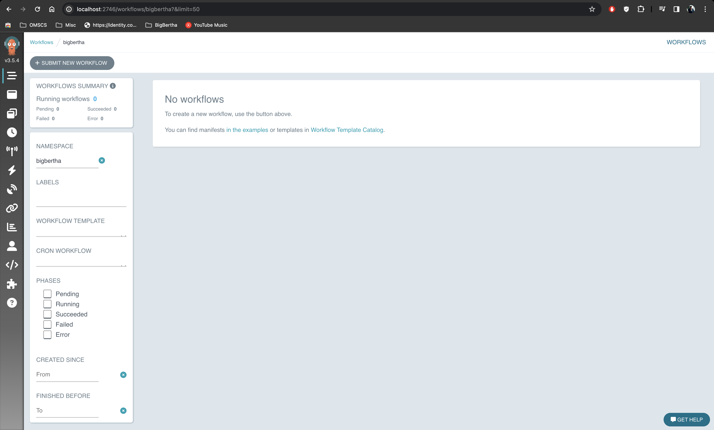

## 6. Milvus Setup
1. To setup the prerequisites, run the [milvus prerequisites script](../k8s/scripts/milvus_prereq.sh). `bash k8s/scripts/milvus_prereq.sh` should get the job done.
2. Run the command `kubectl apply -f k8s/argocd_apps/milvus.yaml` which will install MinIO as an argocd app
3. Navigate to ArgoCD UI, select the MinIO app and click on "Sync">"Synchronize"
4. Observe to ensure that everything gets setup correctly, including the logs of the milvus pods. Sometimes it can take a while for the pods to establish communication with each other so give it a while.
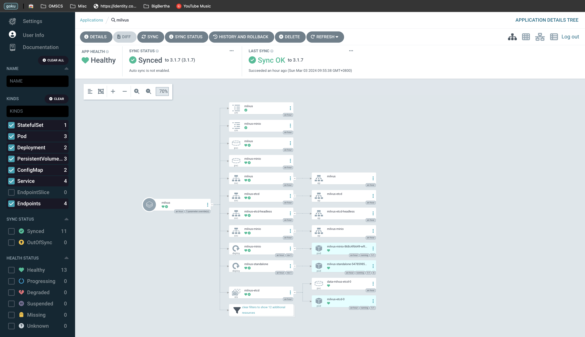

## 7. Kube-Ray & RayCluster
1. To setup KubeRay Operator, simply run `kubectl apply -f k8s/argocd_apps/kuberay-operator.yaml`
2. Navigate to ArgoCD UI and click on "Sync">"Syncrhonize"
3. Observe to ensure that everything gets setup correctly

4. To setup a KubeRay API Server, simply run `kubectl apply -f k8s/argocd_apps/kuberay-apiserver.yaml`
5. Navigate to ArgoCD UI and click on "Sync">"Syncrhonize"
6. Observe to ensure that everything gets setup correctly, including the logs of the mlflow pod
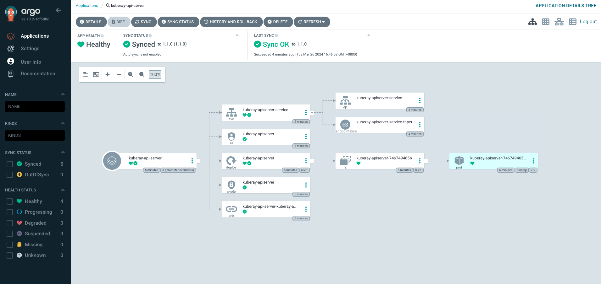
7. Next, install a RayCluster by running `kubectl apply -f k8s/argocd_apps/raycluster.yaml`
8. Navigate to ArgoCD UI and click on "Sync">"Syncrhonize"
9. Observe to ensure that everything gets setup correctly
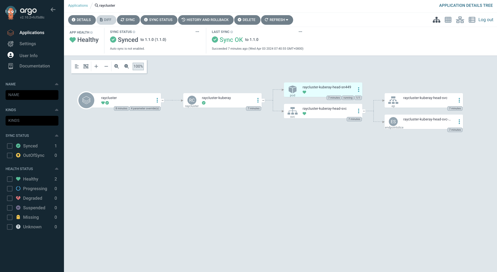

## 8. GOKU setup
1. Run the command `kubectl apply -f k8s/argocd_apps/goku.yaml`
2. Navigate to ArgoCD UI, navigate to the goku app and click on "Details" then "Edit" then "Parameters" tab to replace the placeholder values with the correct values
3. Next, click on "Sync"
4. Observe to ensure that everything gets setup correctly

