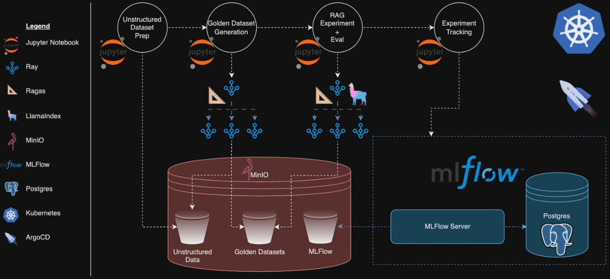
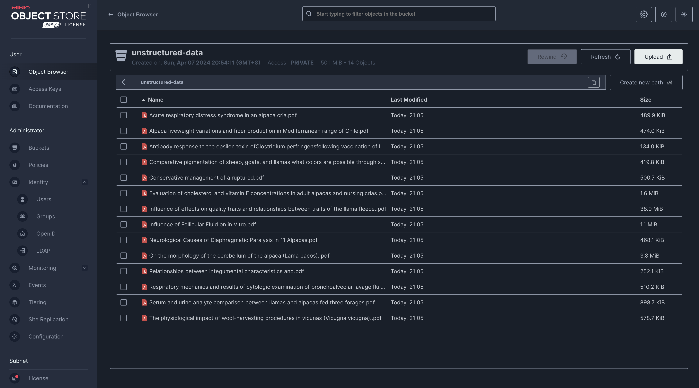
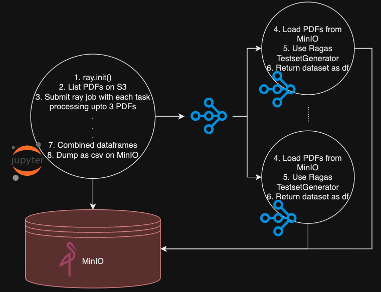
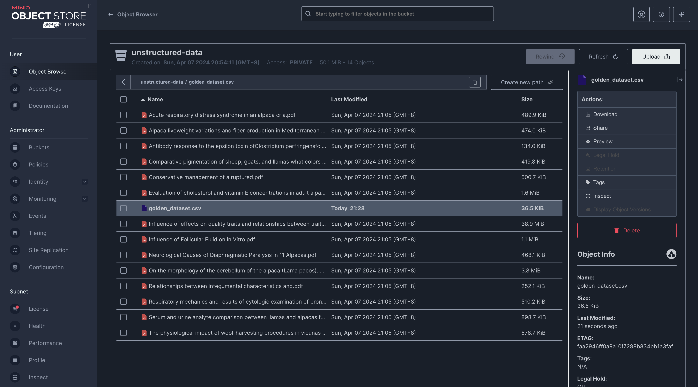
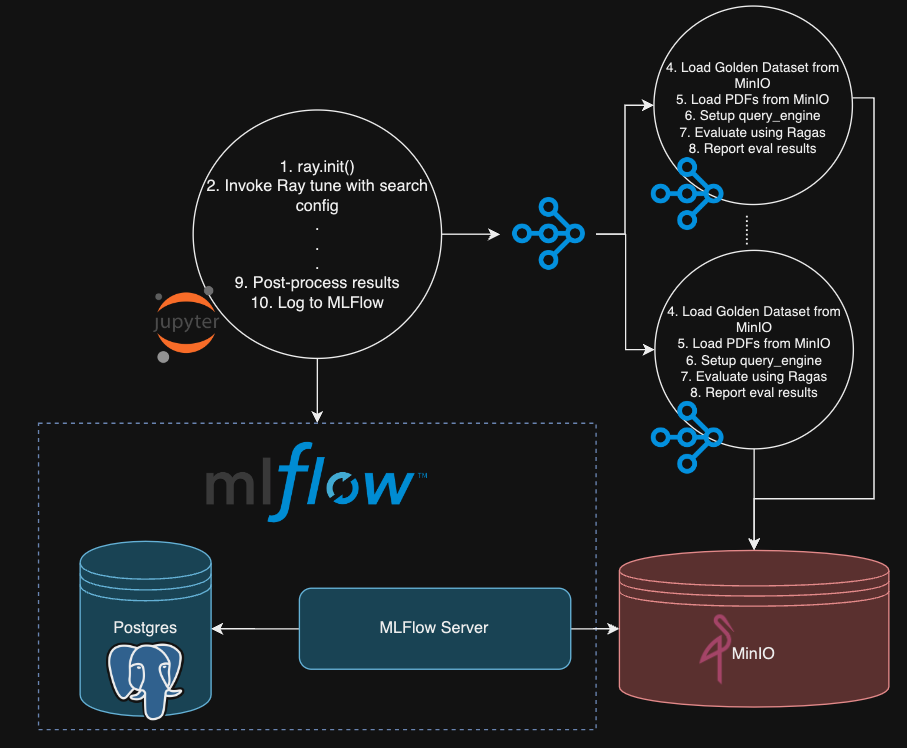
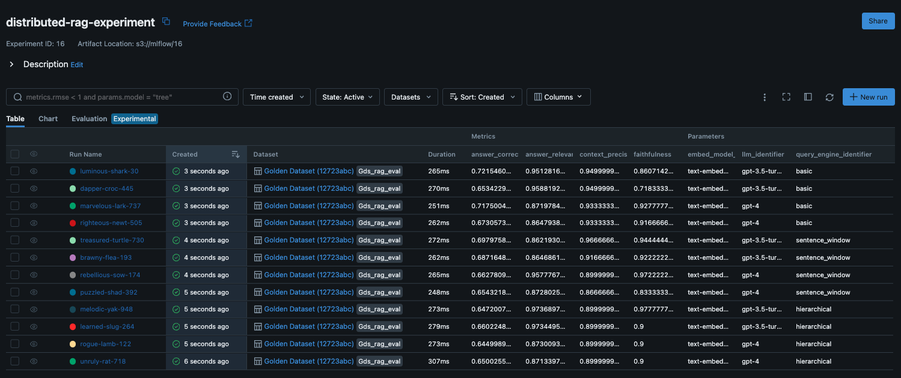

# DREAM: Distributed RAG Experimentation Framework

Distributed RAG Experimentation Framework (DREAM) is a blueprint comprising of a kubernetes native architecture and sample code to demonstrate how Retrieval Augmented Generation experiments, evaluation and tracking can be conducted in a distributed manner using Ray, LlamaIndex, Ragas, MLFlow and MinIO. 

## Why DREAM?
Given the myriad of options for LLMs, embedding models, retrieval methods, re-ranking methods and so on, it can be challenging to determine which combination will work best for your usecase. Who has the time to explore each combination one by one? DREAM shows you how to setup the necessary Kubernetes tooling and run the code necessary to explore the vast search space efficiently.

By setting up the necessary K8s tooling and running the experimentation, evaluation and tracking in a distributed manner, we ultimately want to be able to compare and contrast the different combinations of RAG parameters and pick the one that works best for our usecase.


## Architecture


## Installation
- For installation of Kubernetes , follow the steps provided in [the setup doc](../../docs/installation_guide.md). You can skip the setup of Argo Workflows, Argo Events, Milvus and other GOKU components not needed for DREAM.
- Make sure that the minor version of the Python kernel used in the notebook is the same as that of your Ray cluster. It is advised that you use Conda and Conda virtual environments.
- You might find it useful to `pip install -r requirements.txt` once you have activated your conda virtual environment.
- To verify your Ray and Conda setup, you can launch a notebook and run the following code
```python
import ray
import os

os.environ['RAY_ADDRESS'] = 'ray://localhost:10001'

# Initialize Ray
# ray.init()

@ray.remote
def square(num):
    """A remote function to compute the square of a number."""
    return num * num

# Create a list to hold references to the asynchronous tasks
futures = []

# Distribute the computation of squares across Ray workers
for i in range(100):
    futures.append(square.remote(i))

# Retrieve and print the results
results = ray.get(futures)
print(results)
```


## Code Overview
### Unstructured Data Preparation
- In [this notebook](./1_Unstructued_Data_Preparation.ipynb), we download a bunch of PDFs to act as our unstructured data.
- We then upload these PDFs into a S3 (MinIO) bucket for use later on.


### Distributed Golden Dataset Creation

- In [this notebook](./2_Distributed_Golden_Dataset_Creation.ipynb), we use the Ragas framework to 
- With our Jupyter notebook acting as the Ray driver, we use the ray client to submit the Ray job for creating the golden dataset in a distributed manner.
- In each Ray task, upto 3  PDFs are loaded from S3 and then the ragas framework's TestsetGenerator  is used for synthetic test data generation. Pandas dataframes with the synthetic data are returned by each task.
- The driver (Jupyter notebook), combines the dataframes and dumps the combined dataframe as a csv file onto S3.



### Distributed RAG Experimentation, Evaluation & Tracking

- With our [Jupyter notebook](./3_Distributed_RAG_Experimentation_Evaluation.ipynb) acting as the Ray driver, we use the ray client to submit the Ray Tune job.
- Our search space spans over 3x RAG methods, 2x LLMs 2x embedding models. We use 3 RAG methods native to LlamaIndex - chunks with overlap, sentence window retrieval and hierarchical automerging retrieval. We use gpt-3.5-turbo and gpt-4 as our LLMs, with text-embedding-3-small  and text-embedding-3-large as our embedding models. For evaluation, we use the ragas framework's faithfulness, answer_relevancy, context_precision, context_recall, answer_correctness and answer_similarity as metrics.

